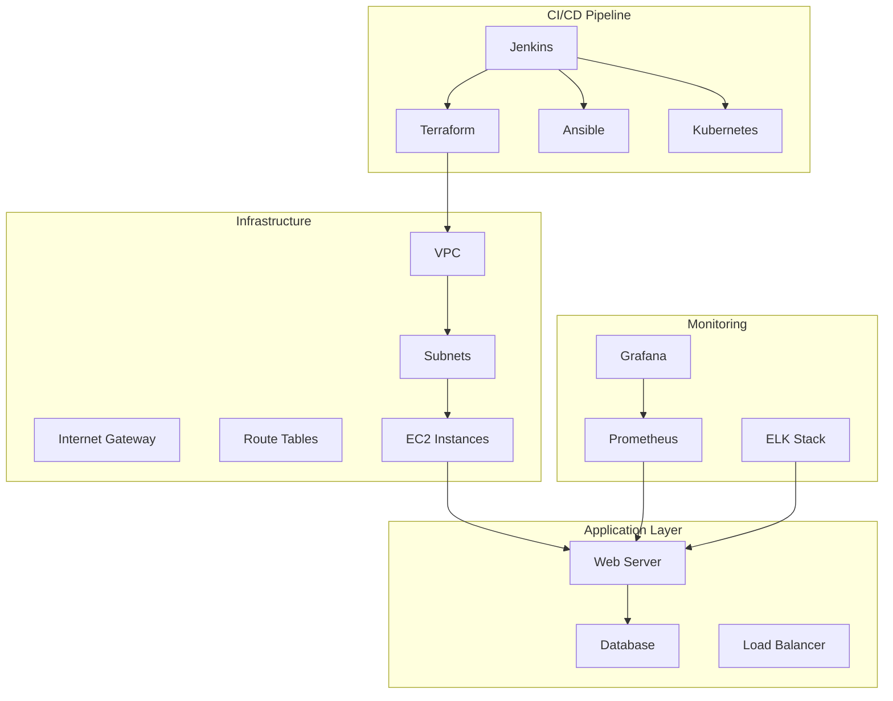

# MERN App DevOps - Production-Ready Infrastructure

[](https://jenkins.example.com/job/mern-app-deploy/)
[](LICENSE)
[](SECURITY.md)

A comprehensive, production-ready DevOps infrastructure for MERN (MongoDB, Express, React, Node.js) applications with full CI/CD pipeline, monitoring, security, and multi-environment support.

## 🚀 Features

- **🔄 Complete CI/CD Pipeline**: Jenkins-powered automated deployment
- **☁️ Multi-Cloud Infrastructure**: AWS Terraform modules
- **🐳 Container Orchestration**: Kubernetes with Helm charts
- **📊 Monitoring & Observability**: Prometheus, Grafana, ELK Stack
- **🔒 Security First**: RBAC, Network Policies, Secret Management
- **🏗️ Environment Management**: Dev, Staging, Production environments
- **🧪 Automated Testing**: Unit, Integration, Security, Performance tests
- **📈 Production Metrics**: Custom Prometheus metrics and alerts

## 🏗️ Architecture



## 📁 Project Structure

```
mern-app-devops/
├── 📂 ansible/                 # Configuration Management
│   ├── 📂 roles/              # Ansible roles
│   │   ├── webserver/         # Web server configuration
│   │   ├── dbserver/          # Database configuration
│   │   └── k8s/               # Kubernetes configuration
│   ├── 📂 inventory/          # Host inventories
│   └── playbook.yaml          # Main playbook
├── 📂 terraform/              # Infrastructure as Code
│   ├── 📂 modules/            # Reusable Terraform modules
│   ├── 📂 envs/               # Environment-specific configs
│   │   ├── dev/               # Development environment
│   │   ├── staging/           # Staging environment
│   │   └── prod/              # Production environment
│   ├── main.tf                # Main Terraform configuration
│   ├── variables.tf           # Terraform variables
│   └── outputs.tf             # Terraform outputs
├── 📂 k8s/                    # Kubernetes Manifests
│   ├── 📂 envs/               # Environment-specific K8s configs
│   ├── webserver-deployment.yaml
│   ├── mongo-deployment.yaml
│   ├── services.yaml
│   └── namespace.yaml
├── 📂 monitoring/             # Monitoring & Observability
│   ├── prometheus/            # Prometheus configurations
│   ├── grafana/               # Grafana dashboards
│   ├── elk/                   # ELK stack configs
│   └── README.md              # Monitoring guide
├── 📂 jenkins/                # Jenkins configurations
│   ├── 📂 scripts/            # Jenkins pipeline scripts
│   └── 📂 shared-libraries/   # Shared Jenkins libraries
├── 📂 scripts/                # Utility scripts
│   ├── deploy.sh              # Deployment script
│   ├── backup.sh              # Backup script
│   ├── health-check.sh        # Health check script
│   └── performance-test.sh    # Performance testing
├── 📄 Jenkinsfile             # Main CI/CD pipeline
├── 📄 README.md               # This file
├── 📄 IMPROVEMENT_PLAN.md     # Improvement roadmap
└── 📄 SECURITY.md             # Security documentation
```

## 🚀 Quick Start

### Prerequisites

- **AWS Account** with appropriate permissions
- **Jenkins** instance with required plugins
- **Docker** for containerization
- **Terraform** (v1.5+)
- **Ansible** (v2.10+)
- **kubectl** for Kubernetes management
- **Helm** for package management

### 1. Infrastructure Setup

```bash
# Clone the repository
git clone https://github.com/your-org/mern-app-devops.git
cd mern-app-devops

# Set up AWS credentials
export AWS_ACCESS_KEY_ID="your-access-key"
export AWS_SECRET_ACCESS_KEY="your-secret-key"

# Initialize Terraform
cd terraform
terraform init

# Deploy infrastructure for development
terraform apply -var-file="envs/dev/dev.tfvars"
```

### 2. Application Deployment

```bash
# Using the deployment script
./scripts/deploy.sh dev

# Or manually with Ansible
cd ansible
ansible-playbook -i inventory/hosts playbook.yaml
```

### 3. Kubernetes Deployment

```bash
# Deploy to Kubernetes
kubectl apply -f k8s/envs/dev/
kubectl get pods -n mern-app-dev
```

## 🔧 Configuration

### Environment Variables

| Variable | Description | Default | Environment |
|----------|-------------|---------|-------------|
| `NODE_ENV` | Application environment | development | All |
| `MONGO_URI` | MongoDB connection string | - | All |
| `JWT_SECRET` | JWT signing secret | - | All |
| `PORT` | Server port | 5000 | All |
| `AWS_REGION` | AWS deployment region | us-east-1 | All |
| `REPLICAS` | Number of pod replicas | 1 | Per environment |

### Terraform Variables

Key variables in `terraform/envs/{env}/{env}.tfvars`:

```hocon
# Development
replicas = 1
webserver_instance_type = "t3.micro"
webserver_cpu_limit = "200m"
webserver_memory_limit = "256Mi"

# Staging
replicas = 2
webserver_instance_type = "t3.small"
webserver_cpu_limit = "500m"
webserver_memory_limit = "512Mi"

# Production
replicas = 3
webserver_instance_type = "t3.medium"
webserver_cpu_limit = "1000m"
webserver_memory_limit = "1024Mi"
```

## 📊 Monitoring & Observability

### Access Dashboards

- **Grafana**: `http://grafana.example.com` (admin/admin)
- **Prometheus**: `http://prometheus.example.com`
- **Kibana**: `http://kibana.example.com`
- **Application Health**: `http://app.example.com/health`
- **Application Metrics**: `http://app.example.com/metrics`

### Key Metrics

- **Application Performance**: Response time, throughput, error rates
- **Infrastructure**: CPU, memory, disk, network usage
- **Database**: Connection count, query performance, replica lag
- **Business Metrics**: User actions, transaction volumes

## 🔒 Security

### Security Features

- **RBAC**: Role-based access control in Kubernetes
- **Network Policies**: Restrict inter-pod communication
- **Secrets Management**: Secure storage of sensitive data
- **Container Scanning**: Automated vulnerability scanning
- **Infrastructure Scanning**: Terraform security analysis
- **HTTPS/TLS**: Encrypted communication
- **Rate Limiting**: Protection against DDoS attacks

### Security Scanning

```bash
# Container security scan
trivy image your-registry/mern-app/webserver:latest

# Infrastructure security scan
tfsec terraform/

# Application security audit
npm audit
```

## 🧪 Testing

### Automated Testing Pipeline

1. **Unit Tests**: Jest for backend, React Testing Library for frontend
2. **Integration Tests**: API testing with Supertest
3. **Security Tests**: OWASP ZAP for security scanning
4. **Performance Tests**: Apache Bench for load testing
5. **Container Tests**: Docker container validation

### Running Tests Locally

```bash
# Backend tests
cd ansible/roles/webserver/files/app
npm test

# Frontend tests
cd ansible/roles/webserver/files/app/client
npm test

# Integration tests
./scripts/integration-tests.sh

# Performance tests
./scripts/performance-test.sh
```

## 📈 Performance Optimization

### Scaling Strategies

- **Horizontal Pod Autoscaling (HPA)**: Automatic pod scaling based on CPU/memory
- **Vertical Pod Autoscaling (VPA)**: Automatic resource adjustment
- **Cluster Autoscaling**: Dynamic node scaling
- **CDN Integration**: Static asset delivery optimization
- **Database Optimization**: Indexing, connection pooling

### Performance Monitoring

```bash
# Real-time performance metrics
kubectl top pods -n mern-app-prod
kubectl top nodes

# Application performance
curl -s http://app.example.com/metrics | grep http_request_duration
```

## 🔄 CI/CD Pipeline

### Jenkins Pipeline Stages

1. **Environment Setup**: Tool installation and configuration
2. **Code Quality**: Linting, formatting, static analysis
3. **Testing**: Unit, integration, and security tests
4. **Build**: Docker image creation and optimization
5. **Security Scan**: Container and infrastructure scanning
6. **Deploy**: Automated deployment to target environment
7. **Validation**: Post-deployment health checks
8. **Monitoring**: Performance and availability monitoring

### Pipeline Configuration

```groovy
// Jenkinsfile - Main pipeline configuration
pipeline {
    agent any
    environment {
        DOCKER_REGISTRY = credentials('DOCKER_REGISTRY_URL')
        IMAGE_TAG = "${BUILD_NUMBER}"
    }
    stages {
        stage('Build') {
            steps {
                // Build Docker images
            }
        }
        stage('Test') {
            parallel {
                // Run test suites
            }
        }
        stage('Deploy') {
            when {
                branch 'main'
            }
            steps {
                // Deploy to production
            }
        }
    }
}
```

## 🚨 Troubleshooting

### Common Issues

1. **MongoDB Connection Issues**
   ```bash
   kubectl logs -f deployment/mongo -n mern-app-dev
   ```

2. **Application Not Starting**
   ```bash
   kubectl describe pod -l app=webserver -n mern-app-dev
   ```

3. **High Memory Usage**
   ```bash
   kubectl top pods -n mern-app-dev
   ```

4. **Database Performance**
   ```bash
   kubectl exec -it deployment/mongo -n mern-app-dev -- mongo --eval "db.stats()"
   ```

### Health Checks

```bash
# Comprehensive health check
./scripts/health-check.sh

# Kubernetes cluster health
kubectl get nodes
kubectl get pods --all-namespaces

# Application endpoints
curl -f http://app.example.com/health
curl -f http://app.example.com/api
```

## 📝 API Documentation

### Endpoints

| Method | Endpoint | Description | Auth Required |
|--------|----------|-------------|---------------|
| GET | `/health` | Health check endpoint | No |
| GET | `/metrics` | Prometheus metrics | No |
| GET | `/api` | Basic API check | No |
| GET | `/api/data` | Sample data endpoint | No |

### Example Responses

```json
// Health Check Response
{
  "uptime": 12345,
  "message": "OK",
  "timestamp": "2023-01-01T12:00:00.000Z",
  "environment": "production",
  "version": "1.0.0",
  "mongo": "connected",
  "memory": {
    "rss": 50331648,
    "heapTotal": 18874368,
    "heapUsed": 11217920
  }
}
```

## 🤝 Contributing

1. Fork the repository
2. Create a feature branch (`git checkout -b feature/amazing-feature`)
3. Commit your changes (`git commit -m 'Add amazing feature'`)
4. Push to the branch (`git push origin feature/amazing-feature`)
5. Open a Pull Request

### Development Workflow

1. **Feature Branch**: Create from `develop`
2. **CI/CD**: Automatic testing and validation
3. **Code Review**: Required for all changes
4. **Merge**: Use squash and merge for clean history

## 📄 License

This project is licensed under the MIT License - see the [LICENSE](LICENSE) file for details.

## 📞 Support

- **Documentation**: [Wiki](https://github.com/your-org/mern-app-devops/wiki)
- **Issues**: [GitHub Issues](https://github.com/your-org/mern-app-devops/issues)
- **Discussions**: [GitHub Discussions](https://github.com/your-org/mern-app-devops/discussions)
- **Email**: devops@yourcompany.com

## 🙏 Acknowledgments

- [Express.js](https://expressjs.com/) - Web framework
- [MongoDB](https://www.mongodb.com/) - Database
- [React](https://reactjs.org/) - Frontend library
- [Kubernetes](https://kubernetes.io/) - Container orchestration
- [Prometheus](https://prometheus.io/) - Monitoring
- [Jenkins](https://www.jenkins.io/) - CI/CD

---

**Built with ❤️ by the DevOps Team**
